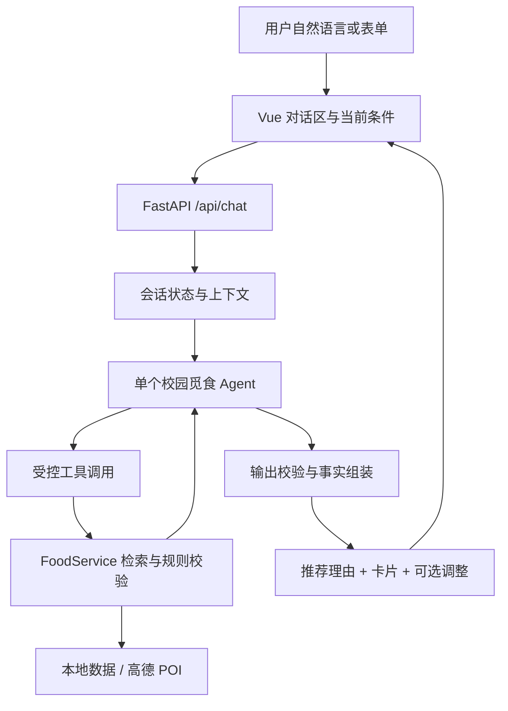

# 校园美食助手 Agent 改造方案

调研及实施日期：2026-09-16。本文先记录当前实施状态，再保留基于 `F:\agent` 原始源码与 Hello-Agents 教程形成的历史设计。配置、操作与实际能力以 [Agent 使用指南](Agent使用指南.md) 为准。

## 当前实施状态

**P0 数据契约、P1 Agent 第一版及部分 P2 可靠性能力已完成。** 已实现统一餐厅 ID 与来源、未知条件单独待确认、共享确定性检索、自然语言条件解析、四个只读业务工具、会话条件与候选快照、卡片及详情联动、经重查验证的条件调整建议。预算、评分与排除条件由服务器验证；模型选择合法候选 ID，面向用户的事实说明由后端数据生成。

当前 Agent 使用异步 **httpx 轻量函数调用适配层**，默认连接 DeepSeek 的兼容接口；没有安装 HelloAgents 框架包。保留对 Hello-Agents 工具、记忆、上下文和评估设计的借鉴，避免直接混用教程不同版本的 API。后端要求 Python 3.11+，使用 `asyncio.timeout` 限制总耗时。

已落地的 P2 内容包括会话隔离与过期、同会话串行化、状态版本检查、请求去重、模型调用与工具次数上限、超时降级，以及高德分区并发查询、短期缓存和区域独立回退。长期偏好持久化尚未实现。P3 路线、菜单知识库、实时营业数据与多 Agent 规划延后，需对应数据源及需求。

当前本地服务运行在 <http://127.0.0.1:5173/>，`LLM_API_KEY` 默认空，表单可使用，对话区显示模型未配置。已通过 61 项后端自动测试、7 个离线业务评估、前端构建，以及浏览器表单、无结果建议应用、过敏原待确认和详情流程。测试中的模型响应是伪造输入；真实 DeepSeek 多轮对话尚未验证，不能据此宣称实际模型能力或线上延迟。

## 原始设计记录

以下第 1–8 节保留实施前的设计依据、建议与阶段划分。“建议”“拟新增”“正式实施先验证”等措辞描述当时方案，不表示对应代码仍未完成；原源码行号仅用于理解历史问题。与当前实现不一致之处以上面的实施状态和使用指南为准。

## 1. 建议落点

把现有校园美食推荐器升级为一个能理解自然语言、调用餐饮工具、维护用餐条件、解释选择与取舍的 Agent。第一版采用 **单 Agent + 受约束的工具调用 + 会话状态 + 结构化结果校验**。

用户价值集中在四件事：一句话表达多个条件；多轮调整而不丢失前文条件；比较候选并解释依据；没有结果时给出有数据支撑的调整方案。继续使用现有 Vue、FastAPI、餐厅卡片、详情抽屉和地图组件。

### 一个可以用当前数据验证的场景

1. 用户：“晚饭想在食堂吃清淡点，人均 15 元以内。”
2. Agent 提取区域、时段、口味偏好、人均预算，调用检索工具。
3. 按当前本地模拟数据，返回“2食堂”，人均参考价 12 元，有“清淡”标签；显示该餐厅卡片和数据来源。
4. 用户：“换一家，预算可以到 20。”
5. 系统保留食堂、晚餐、清淡条件，将预算改为 20，排除上一家，返回“2食堂西餐窗口”，人均参考价 20 元。
6. 用户：“为什么推荐它？”
7. 用本轮检索记录中的价格、区域、标签解释，并说明价格是参考值、数据是本地模拟数据。

两轮结果已直接对当前 `foods.json` 核对，餐厅 ID 分别是 2 和 9。清淡标签不构成“完全不辣”的保证。

## 2. Hello-Agents 的哪些内容适合借鉴

| 参考内容 | 本项目的用法 | 实施时机 |
|---|---|---|
| 第 4 章 ReAct | 根据工具结果选择继续查询、澄清或回答；给调用循环设上限 | 第一版 |
| 第 7 章工具注册、函数调用 | 给现有服务封装有参数类型、返回类型和错误状态的工具 | 第一版 |
| 第 8 章记忆 | 保存当前用餐条件、已经展示和排除的餐厅 ID | 第一版先做会话记忆 |
| 第 9 章上下文工程 | 组织角色规则、当前条件、相关对话、本轮候选证据；限制长度 | 第一版 |
| 第 12 章评估 | 用真实对话样例评价约束、工具选择、事实依据、延迟和成本 | 第一版即建立基线 |
| 第 13 章旅行助手 | 工具获取事实，Pydantic 定义输入输出，前端渲染结构化结果 | 借架构和契约 |
| Extra12 旅行助手后训练实践 | 先明确产品协议、计算和校验规则，再决定是否训练 | 贯穿实施 |
| Plan-and-Solve、多 Agent | 聚餐安排、跨地点或多天计划有真实需求时再引入 | 后续 |
| RAG、MCP | 有校园公告/菜单文档，或工具需要供多个应用使用时再引入 | 后续 |

20 条结构化餐饮记录适合直接查询。向量库不会自动补齐价格、过敏原或实时营业信息。多个 Agent 也不能替代缺失的数据。

## 3. 当前代码的复用点和前置修正

| 当前位置 | 可复用能力 / 现状 | Agent 改造要求 |
|---|---|---|
| `backend/app/services/food_service.py:73` | 已有多条件筛选、排序、返回条数限制 | 将筛选与数据获取分开，补充硬约束/软偏好、排除 ID、排序目标、过滤统计 |
| `backend/app/services/amap_service.py:52`、`food_service.py:29` | 前者查询高德 POI，后者在查询无结果时回退本地数据 | 统一实体 ID，保留来源和查询时间，提供清楚的不可用/回退状态 |
| `backend/app/main.py:50` | 已有 `/api/recommend` | 在同一服务层之上新增 `/api/chat`，表单和 Agent 共用查询规则 |
| `frontend/src/App.vue:231` | 已有请求推荐、更新卡片和地图的方法 | 提取共用结果状态，让表单与对话驱动同一组卡片 |
| `frontend/src/App.vue:288` | 点击卡片显示详情、定位地图 | 支持根据稳定 ID 打开详情；“第二家”解析到本轮候选快照 |

需要先纠正的语义：

- **未知价格**：`food_service.py:126` 当前允许没有价格的餐厅通过预算筛选。严格预算下，未知价格只能列为待确认选项，不能宣称已满足预算。现有字段是人均参考价，不能当作具体菜品报价。
- **未知过敏原**：`food_service.py:154` 会放行空列表，而 `amap_service.py:152` 对实时记录固定填空列表。本地也有 6 条空列表。应区分“有记录”“未采集”“已核实”；未记录不能证明不含某种过敏原。明确禁忌不自动放宽。
- **口味否定**：当前标签匹配是 OR，空标签也通过。“不辣”“不要火锅”需要排除条件；不能简单改写为包含“清淡”。混合标签的餐厅只能说明存在相关标签。
- **营业状态**：当前 20 条模拟记录的 `is_open` 都固定为 true，前端直接显示营业中。应标为未知，或显示“按参考时段推算”，并区分当地时间、节假日和实际营业信息。
- **距离含义**：本地距离无起点元数据；高德距离来自各区域查询中心。没有用户起点和路线数据时，只能显示参考距离，不能声称“离你 300 米”“步行 5 分钟”。
- **稳定 ID**：本地有数字 ID，高德规范化时丢失 POI ID；应统一为 `local:2` / `amap:<poi_id>`。前端当前名称加索引的身份方式不适合跨轮引用。
- **查询与排序**：当前关键词只匹配名称/类型，排序固定评分优先。新增 `sort_by=price/rating/reference_distance` 等明确目标；“当前数据未找到”不等于全校没有此类店铺。
- **接口输入**：为区域、金额、评分、数量等定义枚举和范围。模型工具入参与网页请求都要经过同一验证。

建议实体增加 `source`、`source_record_id`、`fetched_at`、`data_updated_at`、`is_mock`、`price_status`、`allergen_status`、`opening_status`、`distance_basis`。查询时间与源数据更新时间分开：今天读取模拟数据不会让它变成今天更新的真实数据。

## 4. 第一版架构



Agent 负责理解意图、选择工具、决定是否需要澄清、说明取舍。代码负责筛选、排序、数值计算、证据关联和硬条件检查。

### 初始工具集

| 工具 | 输入 | 输出和边界 |
|---|---|---|
| `search_foods` | 经会话状态合并的区域、时段、预算、偏好、排除 ID、排序目标 | 候选快照 ID、实体 ID、字段证据、匹配/未知条件、数量、来源；调用共用 FoodService |
| `get_food_details` | 候选快照 ID、餐厅 ID | 本轮已检索实体的详情，避免重新查询导致事实漂移 |
| `compare_foods` | 本轮 2–3 个 ID、比较维度 | 由代码生成价格/评分/标签等对照，模型据此解释 |
| `suggest_constraint_changes` | 当前条件、允许讨论的条件 | 对有限的替代条件重查，返回修改内容、候选数及代价；不会直接修改当前条件 |

原有高德服务位于检索工具之后；Agent 不必重复选择“本地还是高德”。数据源策略、超时、缓存、按区域回退由服务层控制。第一版工具只读，区域管理接口不加入工具注册表。

无结果诊断不能只看逐步过滤数量，因为数量受过滤顺序影响。可对预算、区域等允许调整的条件做少量独立重查，说明例如“若人均预算改到 20 元，当前数据增加 1 个结果”。只有用户接受调整后才更新条件。

### 调用边界

- 优先使用结构化函数调用；模型输出的参数通过 Pydantic 验证，未知工具拒绝执行。
- 第一版可设每条消息最多 3 轮工具循环、最多 6 次工具调用、总超时 20 秒。这些是待测的工程初值，不是已达到的性能承诺。
- 独立外部查询可以并行；同一会话的状态更新串行化或进行版本校验，避免用户连续发送消息覆盖条件。
- 工具返回有类型的 `ok / empty / unavailable / invalid_input` 状态；空结果与调用失败分别处理。
- 模型未配置或超时时，对话显示清楚状态，原表单仍可使用。已有可靠查询结果可用模板展示；工具失败不能临时生成餐厅事实。
- 用户界面可展示“已理解条件”“查到 3 家”“价格待确认”等操作状态与依据。

## 5. 会话状态和接口契约

后端维护短期会话状态：当前硬条件、软偏好、候选快照、已展示 ID、排除 ID、最后聚焦的餐厅、少量最近消息。第一版可用带过期时间的内存存储；需要重启后继续会话时再落 SQLite。

“预算可以到 20”是对 `max_price` 的修改；未提及的条件继续保留。“取消预算限制”才清除该字段。更新操作区分 `set`、`clear` 与未修改，并关联本轮用户表达。模型的每次工具调用不能擅自覆盖服务器保存的硬条件。

用户通过页面显式修改筛选项也写入同一状态。界面展示当前条件，允许用户纠正解析错误。只有模糊信息影响结果时才追问，例如用户说“我们三个人，预算 60”且未说明总预算还是人均预算。普通“推荐几家”可先使用可见默认条件。

建议新增接口：

```text
POST /api/chat
request: message, session_id?, request_id, expected_state_version?, ui_changes?
response: status, session_id, state_version, reply, constraints,
          recommended_ids, foods, reasons, unknowns,
          suggested_changes, clarification?, trace_id
```

响应约束：

- `recommended_ids` 必须来自本轮合法候选集合；`foods` 的名称、坐标、价格等由后端从候选快照组装。
- `reasons` 关联餐厅 ID 和证据字段；数值比较交给代码，可使用模板保证具体价格/距离表述一致。
- 对自由文本做事实检查；无法验证的具体事实不展示，最多修复一次，仍失败则返回模板化结果。
- 硬条件匹配、未知状态、替代选项在响应中有独立字段，前端不能统一显示成“完全符合”。
- 需要追问时返回 `status=needs_clarification`；查询完成为 `completed`；模型/工具不可用为明确降级状态。
- 第一版先用普通 JSON 请求闭环。需要更好的等待体验时再增加流式事件；模型部分输出不直接替换已经校验的卡片。

长期偏好放在后续：用户可明确保存“通常预算 15–20 元”“喜欢面食”，并查看、修改和删除。会话中的临时条件不自动变成长期习惯；点击餐厅也不等于用户真的吃过。

## 6. 代码改造清单

以下均为拟新增或拟修改项：

```text
backend/app/
  main.py                       注册对话路由，共用服务依赖
  routes/chat.py                对话入口、状态版本、错误与超时
  agents/food_agent.py          工具循环、停止条件、答复生成
  agents/tools.py               工具 schema 与现有服务适配
  agents/prompts.py             角色、数据边界和回答格式
  schemas/chat.py               请求、状态更新、响应模型
  schemas/food.py               统一实体与未知字段定义
  services/food_service.py      共用确定性检索、排序、冲突诊断
  services/amap_service.py      稳定 POI ID、来源与回退状态
  services/session_service.py   短期状态、候选快照、过期机制
  services/llm_service.py       模型/框架适配、配置、超时
backend/evals/
  cases.json                    固定对话与预期约束
  run_eval.py                   对话回归、实体/约束检查、指标输出
frontend/src/
  components/ChatPanel.vue       对话输入、消息、澄清与调整操作
  components/ActiveFilters.vue   可见且可纠正的当前条件
  App.vue                       卡片、详情、地图与对话联动
```

不必一次创建全部抽象层；先按上述职责完成闭环，只有出现复用需求时再进一步拆分。

模型配置仅由后端读取，可采用 `LLM_BASE_URL`、`LLM_API_KEY`、`LLM_MODEL_ID`。优先验证中文约束提取、函数调用和结构化输出能力，再根据评测选择服务商；现阶段没有依据预定某个模型效果最好。

### 是否直接使用 HelloAgents 框架

建议先固定业务工具和输入输出契约，再用一层 AgentRuntime 适配已验证的 HelloAgents 版本。这样可以借其工具注册、会话和上下文能力，也便于替换实现。

本次核验到的版本差异：第 13 章项目要求 `hello-agents[protocols]>=0.2.4,<=0.2.9`，独立框架主分支已标为 1.0.0，官方 README 说明教程对应 `learn_version` 分支。第 7 章安装段还是 0.1.1，而 FunctionCallAgent 小节明确是后续版本加入。安装最新包后照抄不同章节可能不兼容。

正式实施先在隔离环境验证“一个自定义只读工具 + 两轮条件修改 + 超时退出”，确认接口和异步能力后锁定版本。FastAPI 路由应使用异步模型/工具接口；同步框架调用需要明确隔离，不能阻塞事件循环。本次仅做静态调研，未验证框架的运行兼容性。

## 7. 分阶段交付和验收

| 阶段 | 交付结果 | 完成标准 |
|---|---|---|
| P0 数据契约 | 统一 ID、未知值、来源、参考距离；明确预算与禁忌语义 | 表单与工具对同一条件得到一致结果；未知事实不会被写成确定结论 |
| P1 Agent MVP | 对话入口、4 个以内业务工具、会话状态、卡片联动 | 自然语言检索、多轮改预算、换一家、候选比较、无结果调整均可完成 |
| P2 体验与稳定性 | 可见条件、必要澄清、操作状态、缓存、观测记录、显式长期偏好 | 会话隔离、超时降级、并发状态一致；得到真实延迟和成本数据 |
| P3 数据驱动扩展 | 路线 API、菜单/公告检索、复杂聚餐计划 | 每项新能力都有可信数据源和专门验收集 |

第一版固定至少以下回归场景：

| 对话或条件 | 期望 |
|---|---|
| 食堂、晚餐、清淡、人均 15 元 | 当前模拟数据返回 `local:2` |
| 接上轮：“换一家，预算到 20” | 保留区域/时段/口味，排除 `local:2`，返回 `local:9` |
| 食堂、晚餐、清淡、预算 15、评分至少 4.5 | 当前数据无结果；提出可验证的条件调整，不自行更改 |
| “不辣”“不要火锅” | 识别排除条件；标签不足则说明未知或澄清 |
| 明确某过敏禁忌，候选信息未知 | 不标成已满足该硬条件；不能作过敏安全保证 |
| 价格未知且用户强调预算上限 | 与已知预算内结果分开显示 |
| “步行十分钟以内”“现在开着吗” | 无起点/路线/营业证据时不生成精确承诺 |
| “第二家呢”后又改变候选列表 | 引用明确的会话候选快照，歧义时澄清 |
| 模型输出不存在的 ID 或改写价格 | 后端拦截，修复一次或模板降级 |
| 高德失败、模型超时、未配置模型 | 状态清楚，原表单仍能使用 |
| 两个会话交错请求 | 条件、候选、历史互不串用 |
| 同一会话连续修改预算 | 版本控制阻止旧响应覆盖新条件 |

把“表单推荐”与“自然语言参数提取后固定检索”作为两个基线，再与有工具循环的 Agent 比较，确认循环带来的价值。

程序评分检查参数、ID、硬条件、数值、未知状态；人工评估理由是否有用、澄清是否必要。模型评审只能辅助。记录任务完成率、违规数量、事实有据率、平均模型/工具调用次数、token 用量、P50/P95 延迟。

固定测试集内，非法实体 ID、硬条件被静默放宽、未知信息被说成已核实应为零；这是验收要求，不代表已在开放场景中获得保证。模型质量和延迟目标在选定模型并得到基线后确定。

## 8. 参考来源

- [Hello-Agents 教程](https://github.com/datawhalechina/hello-agents)
- [第 4 章：智能体经典范式构建](https://github.com/datawhalechina/hello-agents/blob/main/docs/chapter4/第四章%20智能体经典范式构建.md)
- [第 7 章：构建你的 Agent 框架](https://github.com/datawhalechina/hello-agents/blob/main/docs/chapter7/第七章%20构建你的Agent框架.md)
- [第 8 章：记忆与检索](https://github.com/datawhalechina/hello-agents/blob/main/docs/chapter8/第八章%20记忆与检索.md)
- [第 9 章：上下文工程](https://github.com/datawhalechina/hello-agents/blob/main/docs/chapter9/第九章%20上下文工程.md)
- [第 12 章：智能体性能评估](https://github.com/datawhalechina/hello-agents/blob/main/docs/chapter12/第十二章%20智能体性能评估.md)
- [第 13 章：智能旅行助手](https://github.com/datawhalechina/hello-agents/blob/main/docs/chapter13/第十三章%20智能旅行助手.md)
- [第 13 章依赖版本](https://github.com/datawhalechina/hello-agents/blob/main/code/chapter13/helloagents-trip-planner/backend/requirements.txt)
- [Extra12：旅行助手后训练实战](https://github.com/datawhalechina/hello-agents/blob/main/Extra-Chapter/Extra12-旅行助手后训练实战.md)
- [HelloAgents 框架版本说明](https://github.com/jjyaoao/helloagents/blob/main/README.md)

以上历史架构、工具契约与阶段划分是针对校园美食项目形成的设计建议，未将教程案例的性能数字视作本项目实测结果；当前交付与验证范围见本文开头“当前实施状态”。
