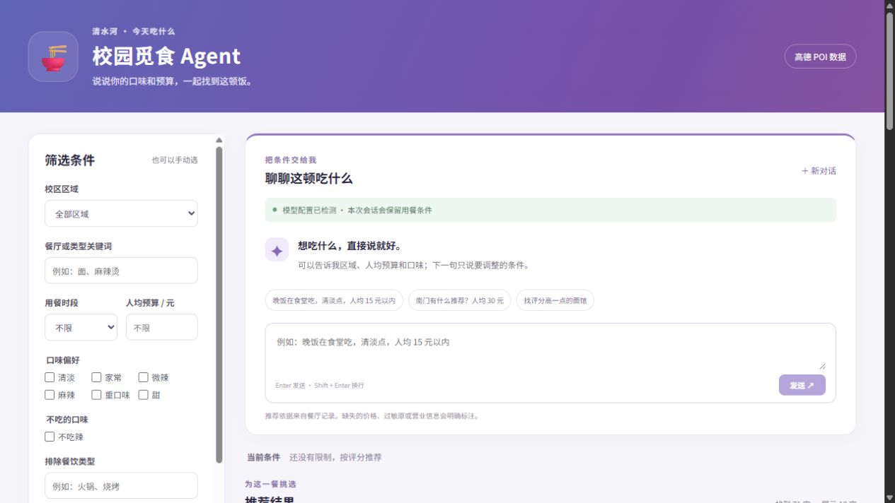
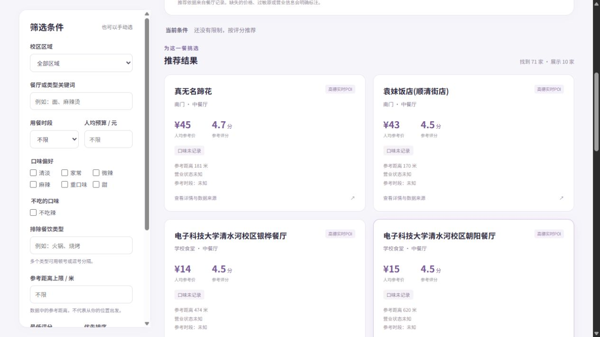
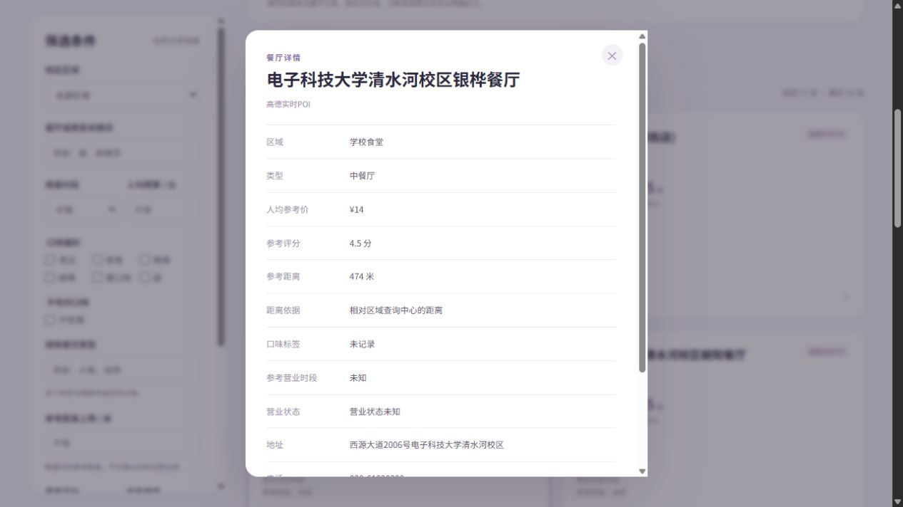
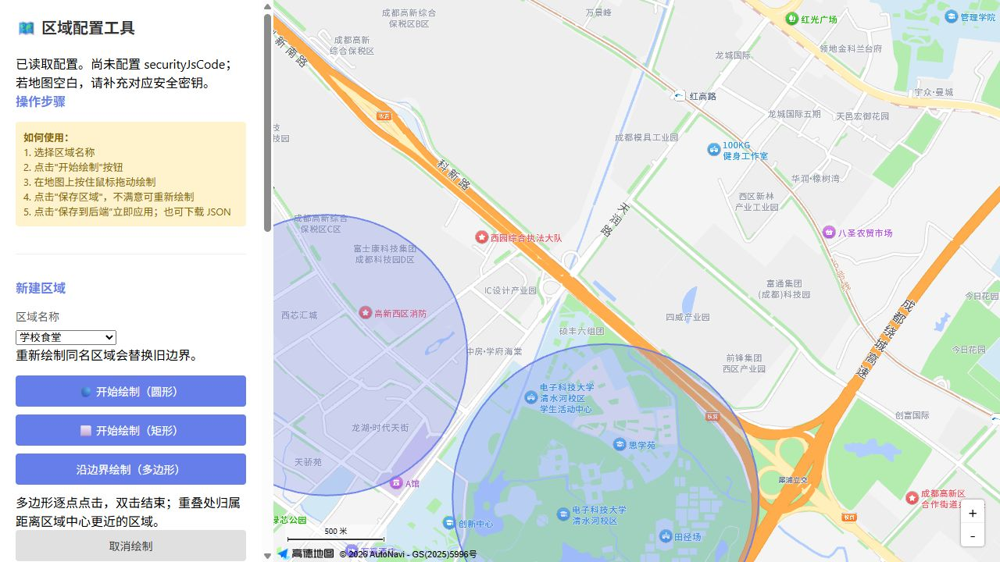
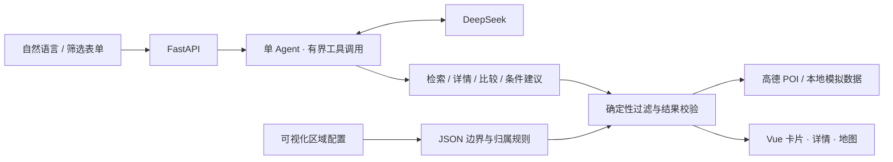

<div align="center">

# 🍜 清水河 · 校园觅食 Agent

### 少纠结一顿饭，多一点有依据的选择。

用一句话找到想吃的，再把预算、口味和位置慢慢聊清楚。


[界面与功能](#-界面与功能) · [快速开始](#-快速开始) · [架构](#-如何工作) · [使用指南](Agent使用指南.md) · [前端展示页源码](docs/index.html)



</div>

> 面向电子科技大学清水河校区的餐饮推荐应用。**自然语言对话 + 确定性筛选 + 高德 POI + 可编辑区域边界**，把“今天吃什么”变成一个可解释、可调整的选择过程。

## ✨ 为什么试试它

| 你想做的事 | 应用如何帮你 |
| --- | --- |
| “学校食堂，人均 20 元以内” | 提取条件、查询候选，同步展示预算与区域 |
| “换一家，预算可以到 25” | 保留会话条件，调整预算并排除已推荐候选 |
| “这两家有什么区别？” | 基于实际候选记录比较，展示价格、评分与信息缺口 |
| 条件太严格，找不到结果 | 重查可行调整方案，由你决定是否接受 |
| 只想看看校内，不想混入校外 | 圆形、矩形、多边形圈选；按坐标边界和区域归属过滤 |
| 没有模型或地图 Key | 保留表单筛选；无高德 Key 时使用标注清楚的 20 条模拟记录 |

**把不确定性说清楚。** 未知价格、缺失口味和未核实的过敏原不会被包装成“完全符合”；模型不能自行编造餐厅 ID 或改写价格。

## 🖼 界面与功能

以下为 **2026-09-17 本地运行时的真实界面截图**，使用高德 POI。商家信息和返回数量随查询变化；截图中的价格、评分均为参考信息。

### 01 / 推荐卡片，让每个选择有据可查

区域、关键词、预算、评分与排除条件共同筛选。切换区域立即刷新结果和地图，避免旧列表与新条件混淆。



<details>
<summary><strong>02 / 餐厅详情：来源、价格与未知信息</strong></summary>

详情显示数据来源、区域、地址、参考距离及信息缺口。地图标记和卡片联动，不把区域中心距离当作实际步行距离。



</details>

<details>
<summary><strong>03 / 自己画区域：圈选 → 保存 → 立即查询</strong></summary>

配置工具自动读取已有边界和前端地图配置。支持圆形、矩形、多边形、JSON 预览及下载，保存到后端后无需重启。重叠处按距区域中心最近的规则确定唯一归属。



</details>

**独立展示页：** 下载项目后直接打开 [`docs/index.html`](docs/index.html)，无需后端或 API Key 即可浏览截图与功能介绍；它是静态展示，不是在线推荐服务。

## 🚀 快速开始

需要 **Python 3.11+、Node.js 18+ 和 npm**。以下以 Windows PowerShell 为例。

```powershell
git clone https://github.com/xRayyyyyyy/qingshuihe-campus-food-guide.git
cd qingshuihe-campus-food-guide
python -m venv backend/.venv
./backend/.venv/Scripts/python.exe -m pip install -r backend/requirements.txt
npm --prefix frontend ci
Copy-Item backend/.env.example backend/.env
Copy-Item frontend/.env.local.example frontend/.env.local
```

已有 `.env` 时请直接编辑，不要覆盖自己的配置。

### 按需配置能力

| 功能 | 配置位置 | 变量 |
| --- | --- | --- |
| DeepSeek 自然语言对话 | `backend/.env` | `LLM_API_KEY` |
| 真实餐厅 POI 查询 | `backend/.env` | `AMAP_WEB_KEY`，高德 **Web 服务**类型 |
| 地图与区域圈选 | `frontend/.env.local` | `VITE_AMAP_JS_KEY`，高德 **Web 端（JS API）**类型 |
| 地图安全校验 | `frontend/.env.local` | 对应 Key 的 `VITE_AMAP_SECURITY_CODE` |

后端默认模型地址为 `https://api.deepseek.com`，模型为 `deepseek-chat`。**模型及 Web 服务密钥仅放在后端**；示例文件不含真实密钥。JS API Key 与 Web 服务 Key 不能互换。

```powershell
./start.cmd
# 停止：./stop.cmd
```

| 入口 | 地址 |
| --- | --- |
| 应用首页 | http://127.0.0.1:5173/ |
| 区域配置 | http://127.0.0.1:8000/area-config |
| API 文档 | http://127.0.0.1:8000/docs |

<details>
<summary>macOS / Linux 启动方式</summary>

```bash
python3 -m venv backend/.venv
backend/.venv/bin/python -m pip install -r backend/requirements.txt
npm --prefix frontend ci
cp backend/.env.example backend/.env
cp frontend/.env.local.example frontend/.env.local
# 编辑配置后，在两个终端分别启动：
cd backend && .venv/bin/python -m uvicorn app.main:app --host 127.0.0.1 --port 8000
# 另一个终端，在项目根目录执行：
npm --prefix frontend run dev -- --host 127.0.0.1
```

</details>

## 🧠 如何工作



- **前端：** Vue 3、Vite，表单与对话共享可见条件。
- **Agent：** 异步 httpx 函数调用适配层，工具调用和总耗时有上限；借鉴 [Hello-Agents](https://github.com/datawhalechina/hello-agents) 的工具、记忆与评估设计，未依赖其框架包。
- **可靠性：** 会话隔离、过期、串行更新、状态版本检查、请求重试去重和超时提示。
- **数据：** 分区并发查询、短期缓存、失败独立回退；配置边界变化会更新缓存标识。

```text
backend/app/
  agents/       Agent、提示词与业务工具
  routes/       对话 API 与区域配置
  schemas/      输入、条件与输出契约
  services/     检索、模型、高德及会话管理
  data/         20 条本地模拟餐饮记录
backend/tests/  自动回归测试
backend/evals/  离线业务评估
frontend/src/   Vue 界面与组件
docs/           静态展示页与功能截图
区域配置工具.html  后端托管的地图圈选工具
```

## ✅ 验证与边界

截至 2026-09-17：**68 项自动测试、7 个离线业务评估及前端生产构建通过**；已实测 DeepSeek 接口连通、高德真实 POI、区域切换、卡片详情及圆形/矩形绘制。离线测试使用固定数据和模拟模型响应，不代表真实模型的完整质量评估。

```powershell
cd backend
./.venv/Scripts/python.exe -m unittest discover -s tests -v
./.venv/Scripts/python.exe evals/run_eval.py
cd ..
npm --prefix frontend run build
```

- 本地数据是 **20 条模拟记录**，不是经核实的商家资料；高德回退结果会明确标注来源。
- 圈选区域是查询边界，不自动代表行政或校园边界；目前支持学校食堂、南门、天街三个业务区域。
- 高德查询有返回条数限制，不保证穷尽区域内所有商家。
- 价格、评分和距离为参考信息，营业状态及过敏原没有实时核实保证。
- 会话保存在内存中，重启后清空；长期偏好、真实路线和菜单知识库尚未实现。
- 区域管理接口面向本机开发使用，未加入身份认证；公网部署前需增加访问控制。

## 📚 继续了解

[Agent 使用指南](Agent使用指南.md) · [本地部署说明](本地部署说明.md) · [架构与改造方案](Agent改造方案.md) · [当前状态](当前状态.md)

历史文档记录了项目早期实现；当前行为以本 README 和使用指南为准。

## License

[MIT](LICENSE) · 欢迎通过 Issue 反馈问题，或提交 Pull Request 改进校园用餐体验。
